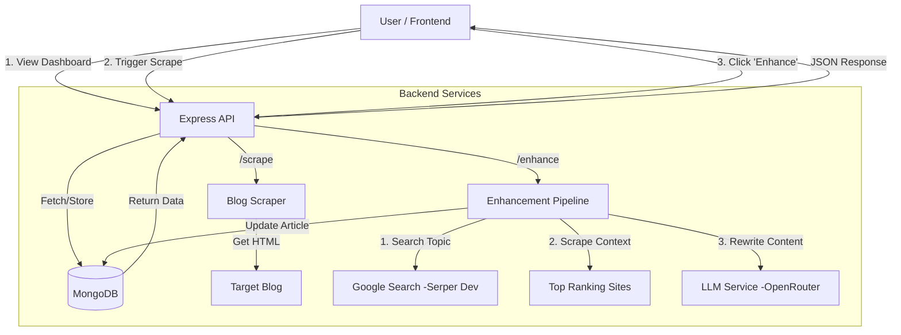

# Article Enhancement & Scraper Platform

A full-stack application that scrapes articles from external blogs, stores them, and uses AI to rewrite and enhance the content based on top-ranking Google search results. The project features a responsive React frontend for managing articles and a Node.js/Express backend for the heavy lifting.

## 🚀 Features

- **Automated Scraping**: Fetches articles from external sources (e.g., BeyondChats) and avoids duplicates.
- **AI Enhancement**:
  - **Contextual Search**: Searches Google for the article's topic to find high-ranking competitors.
  - **Content Analysis**: Scrapes competitor content to understand successful structures.
  - **Intelligent Rewriting**: Uses an LLM (via OpenRouter) to rewrite the article for better SEO and engagement.
- **Dual View**: Access both the original scraped version and the AI-enhanced version of any article.
- **Dashboard**: A clean, responsive UI to manage scraping and enhancement tasks.

---

## 🏗️ Architecture & Data Flow

The system follows a modular architecture separating the scraping logic, AI processing, and user interface.



---

## 🛠️ Local Setup Instructions

Follow these steps to get the project running on your local machine.

### Prerequisites

- **Node.js** (v16 or higher)
- **MongoDB** (Local instance or MongoDB Atlas connection string)
- **API Keys**:
- [Serper.dev](https://serper.dev/) (For Google Search results)
- [OpenRouter](https://openrouter.ai/) (For LLM access)

### 1. Backend Setup

1. Navigate to the backend directory:

```bash
cd server

```

2. Install dependencies:

```bash
npm install

```

3. Create a `.env` file in the `server` directory with the following variables:

```env
PORT=5000
# Your MongoDB connection string
MONGODB_URI=mongodb://localhost:27017/article-db

# Required for Enhancement features
SERPER_API_KEY=your_serper_api_key
OPENROUTER_API_KEY=your_openrouter_api_key

# Optional: Base URL for the API
API_BASE_URL=http://localhost:5000

```

4. Start the server:

```bash
npm start

```

_The server should now be running on `http://localhost:5000_`

### 2. Frontend Setup

1. Open a new terminal and navigate to the client directory:

```bash
cd client

```

2. Install dependencies:

```bash
npm install

```

3. Start the React application:

```bash
npm start

```

_The application will open automatically at `http://localhost:3000_`

---

## 🌐 Live Demo

You can view the live deployment of the frontend here:

**(https://article-scraper-one.vercel.app/)**

> **How to use:**
> 
>
> 1. **Dashboard**: You will see a list of articles.
> 2. **Scrape**: Click "Scrape New" to fetch the latest articles from the source.
> 3. **Enhance**: Click the "✨ Enhance" button on any card marked "Original". The app will process the article (approx. 10-20 seconds) and tag it as "Enhanced".
> 4. **Compare**: Click the card to read the full content.

---

https://github.com/user-attachments/assets/c4ff7fd1-a8b3-448b-b424-d2f6ca892ce8


## 📁 Project Structure

```text
├── client/                 # React Frontend
│   ├── src/
│   │   ├── components/     # UI Components
│   │   ├── pages/          # Dashboard & Article View pages
│   │   └── api.js          # Axios configuration & endpoints
│
├── server/                 # Node.js Backend
│   ├── controllers/        # Request logic (articleController.js)
│   ├── models/             # Mongoose Schemas (Article.js)
│   ├── routes/             # API Routes (articleRoutes.js)
│   ├── scraper/            # Logic to scrape the source blog
│   ├── scripts/            # CLI utilities for testing/bulk operations
│   └── services/           # Helper services
│       ├── apiClient.js    # Internal API calls
│       ├── contentScraper.js # Cheerio logic for reading reference sites
│       ├── googleSearch.js   # Serper API integration
│       └── llmService.js     # OpenRouter/OpenAI integration
```
